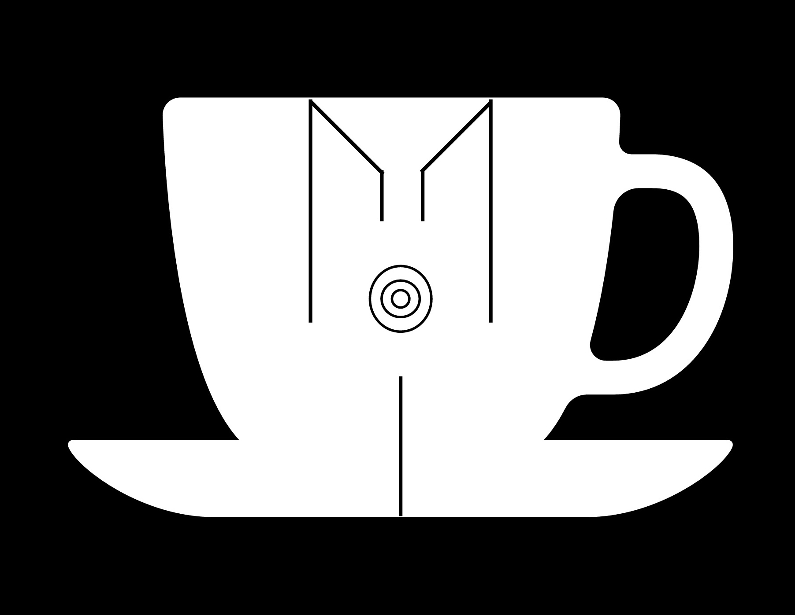

Copyright ©️ 2022-2023, Macchiato Incorporated. All Rights Reserved.

   <ul class="menu-items">
      <li class="item"><a class="itemLink" onclick="hideMenu(this)">MIST<a/><li/>
      <li class="item"><a class="itemLink" onclick="hideMenu(this)">Security<a/><li/>
      <li class="item"><a class="itemLink" onclick="hideMenu(this)">DLT<a/><li/>
      <li class="item"><a class="itemLink" onclick="hideMenu(this)">Cloud<a/><li/>
      <li class="item"><a class="itemLink" onclick="hideMenu(this)">Networking<a/><li/>
      <li class="item"><a class="itemLink" onclick="hideMenu(this)">Connect<a/><li/>
   <ul/>

<script>
var logo = document.getElementById("logo");
var icon = document.getElementById("icon");
var dropdown = document.getElementById("dropdown");
var links = document.getElementsByClassName("itemLink");

function showMenu(mi) {
dropdown.style.display = "block";
}

function hideMenu(mi) {
dropdown.style.display = "none";
}
<script/>
